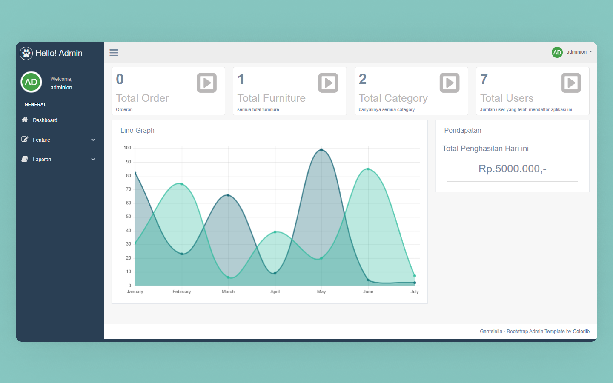

<div align="center">
  <a href="https://github.com/destroylord/meubel-kurnia-backend">
    
  </a>

  <h3 align="center">Mebel Kurnia</h3>

  <p align="center">
    An awesome README template to jumpstart your projects!
    <br />
    <a href="https://github.com/destroylord/meubel-kurnia-backend/wiki/Docs-API"><strong>Explore the docs API»</strong></a>
    <br />
    <br />
    <a href="http://mebel-kurnia.evoindo.xyz/">View Demo</a>
    ·
    <a href="https://github.com/destroylord/meubel-kurnia-backend/issues">Report Bug</a>
    ·
    <a href="https://github.com/destroylord/meubel-kurnia-backend/issues">Request Feature</a>
  </p>
</div>

## Tentang Project


Mebel Kurnia adalah aplikasi pemesanan mebel di yang berada di Bondowoso. Semua mebel yang diperlukan tersedia diaplikasi ini.

## Instalasi

1. Buatlah sebuah database di PMA(PhpMyAdmin)
2. Import file database di folder ``db/mebel_kurnia.sql``
3. Buatlah sebuah file config.php pada folder ``core`` kemudian ambil code dari README.md di folder core
4. Buka terminal kemudian jalankan perintah ``php -S localhost:8080``
5. Happy Coding :)

### Login

```sheell
username: admin
password: adinda8
```

## Tech Stack

Kami memilih framework bootstrap untuk menggunakan tampilan pada aplikasi ini, dsini ada juga bahasa pemograman yang digunakanan diantaranya : 

* PHP v7.4

## Team

1. Fahmi Dafrin Maulana     - Web Developer
2. Eggi Permana Sunarya    - Mobile Application
3. Sekar Mauliyah           - UI/UX Designer
4. Nelly Maulia            - Quality Assurance

## Contact

Nelly Maulia - nellymaulia679@gmail.com
